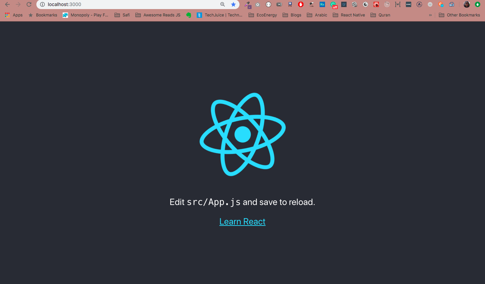

# 3rd September - TechKaro (React)

### What did we study today?
We studied the following topics:
- What is Node?
  - Node is a command line tool. It understands Javascript like the Web Browser.
  - You can use Node to run JS in command prompt.
- How to install Node?
  - Go to [NodeJS website](https://nodejs.org/en/), download the LTS version, and then double click the downloaded file to install
  - Open your command prompt and type `node --version`. It should show the version of your node installation `v10.16.3`
- How to use Node?
  - Create a new folder. Add a `script.js` inside it. Write some JS in it with console.log statements.
  - Open Command Prompt inside that folder
  - Type `node script.js` to see the console.log output of `script.js` file.
- What is NPM (Node Package Manager)?
  - It is a Command Line Tool that is used to install 3rd-party Javascript libraries
- What is Command Prompt?
  - It is a text-based User Interface that accepts commands through keyboard only
- What is a Command Line Tool?
  - A command line tool is a tool that is used inside the command prompt
- Format of commands in Command Prompt
    ```
    $ toolName command flags
    ```
    Example:
    ```
    $ npm install tetris -g
    ```
    Here,
    `npm` is the tool name
    `install tetris` is the command
    `-g` is the flag. It can also be written as `--global`
- How to open command prompt?
  - Click Windows key, type `cmd`, press Enter.
- How to open command prompt inside a specific folder?
  - Open the folder
  - In the search bar, remove the folder address, type `cmd` press Enter
- Local vs Global NPM packages
  - Local: Installed inside the folder you are currently in. You can access locally installed packages only inside the folder where you ran the command. 
  - Global: Installed globally in your computer. You can access global from anywhere in your computer
- How to start using NPM to install packages locally?
  - Run the following commands:
    - `npm init` (This will generate a package.json file. Run this command only if you do not have a package.json file already in your folder)
    - `npm install packagename` to install any packages locally.
- What is `node_modules` folder?
  - It is an auto-generated folder where all locally installed packages are stored.
- How to install an NPM package globally?
  - Use the `--global` flag (shortform `-g`) like this: `npm install packagename -g`
- What is an NPM package?
  - If you are too busy, you sometimes do not write all JS code yourself, but use code written by someone else. This ready-made code is called an `NPM package`
- What are the two types of NPM packages?
  - Packages that you use inside your code. **These packages are installed locally** Examples: [boxen](https://github.com/sindresorhus/boxen), [better-console](https://github.com/mohsen1/better-console), [camelCase](https://github.com/sindresorhus/camelcase)
  - Packages that are used as Command Line Tools. **These packages are installed globally**. Examples: [birthday](https://www.npmjs.com/package/birthday), [tetris](https://www.npmjs.com/package/tetris), [create-react-app](https://github.com/facebook/create-react-app).
- How to find an NPM package?
  - Just Google it using keywords!
- What is [create-react-app](https://github.com/facebook/create-react-app#creating-an-app)?
  - It is an NPM package installed globally. It is a Command Line tool used to create a ready-made React project (also called "scaffold")

### Homework
Write the HTML and Responsive CSS of [Github Home Page (signed out)](https://github.com) inside the React project. It looks like [this](github-png-slicing.png). **Deadline: 12th Sept**. 
- Create the React project using `create-react-app`
- Write all your CSS inside `src/App.css`
- Write all your HTML inside `src/App.js`

### Some Important Commands
Open Command prompt to type the following commands:

To check if Node is installed, type
```
node --version
```
OR 
```
node -v
```

To check if NPM is installed, type
```
npm --version
```
OR 
```
npm -v
```

To install a node package locally,
First go to the folder where you want to install it.
Check if there is a package.json. If not, run
```
npm init
```
It will ask some questions and then automatically create a package.json file.

When you are sure that you have the package.json, you can install any NPM package locally using the command:
```
npm install packagename
```
For example, to install the [boxen](https://github.com/sindresorhus/boxen) package, run
```
npm install boxen
```

To install a package globally, use the -g flag.
```
npm install packagename -g
```
For example, to install the [tetris](https://www.npmjs.com/package/tetris) package, run
```
npm install tetris -g
```

To delete a local package, run
```
npm uninstall packagename -g
```

To delete a global package, run
```
npm uninstall packagename -g
```

To install create-react-app, run
```
npm install create-react-app -g
```
It is installed globally because it is a command line tool.

To create a ready-made React app using create-react-app, run
```
create-react-app my-app
```
- Make sure you have installed create-react-app globally, before creating the React project
- You can use any name you wish in place of `my-app`, but the name should be in Kebab Case (some-name-with-dashes)
- This command takes some time to complete - approx 5-10 minutes depending on your internet speed

To run your React project, open the Command Prompt inside your `my-app` React project and run
```
npm start
```
**Note: If you're getting an error here, it means you have not opened your command prompt in your React app folder**
The `npm start` command will automatically open your app in the web-browser at `localhost:3000`. You should see a screen like this:

